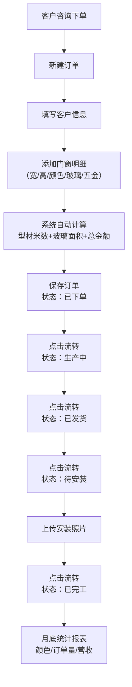

## 1. 产品概述

门窗店订单管理系统，专为小型门窗门店设计。解决订单记录混乱、进度跟踪不清、材料计算易出错、客户历史难以追溯等痛点。目标用户为门店老板及店员，通过数字化管理提升运营效率，减少人工计算误差。

- 核心价值：自动计算型材/玻璃用量，一键更新生产进度，快速查询客户历史，月度数据统计一目了然
- 市场定位：轻量化、易上手、无需培训即可使用的门店级管理工具

## 2. 核心功能

### 2.1 用户角色
| 角色 | 登录方式 | 核心权限 |
|------|----------|----------|
| 店主/店员 | 免登录（本地存储） | 全部功能：订单管理、客户管理、进度更新、统计查看 |

### 2.2 功能模块
1. **仪表盘**：今日订单概览、各状态订单数量卡片、月度业绩趋势、快捷操作入口
2. **订单管理**：订单列表、新建订单、编辑订单、删除订单、进度一键流转、安装照片上传
3. **客户管理**：客户列表、客户历史订单查询、客户消费金额统计
4. **统计报表**：月度订单量统计、型材颜色销量排行、玻璃类型分布、收入趋势

### 2.3 页面详情
| 页面名称 | 模块名称 | 功能描述 |
|----------|----------|----------|
| 仪表盘 | 统计卡片 | 显示订单总数、待安装数、本月营收、平均客单价 |
| 仪表盘 | 进度分布 | 饼图展示各生产状态订单数量占比 |
| 仪表盘 | 最近订单 | 表格展示最近5条订单的简要信息 |
| 仪表盘 | 快捷操作 | 新建订单、客户查询两个快捷按钮 |
| 订单列表 | 搜索筛选 | 按客户姓名、订单状态、下单日期筛选 |
| 订单列表 | 订单卡片 | 展示客户、地址、金额、状态、操作按钮 |
| 订单列表 | 进度按钮 | 点击后流转到下一状态（已下单→生产中→已发货→待安装→已完工） |
| 新建/编辑订单 | 客户信息 | 客户姓名、电话、地址输入 |
| 新建/编辑订单 | 门窗明细 | 多扇门窗：宽/高/型材颜色/玻璃类型/五金品牌/单价/数量 |
| 新建/编辑订单 | 自动计算 | 实时计算型材总米数、玻璃总面积、订单总金额 |
| 新建/编辑订单 | 照片上传 | 完工后上传安装现场照片 |
| 客户详情 | 客户信息 | 姓名、电话、地址 |
| 客户详情 | 历史订单 | 该客户所有历史订单列表及消费总额 |
| 统计报表 | 月度概览 | 本月订单数、总营收、平均客单价同比环比 |
| 统计报表 | 颜色排行 | 型材颜色销量柱状图 |
| 统计报表 | 玻璃分布 | 单层/双层玻璃占比饼图 |

## 3. 核心流程

### 3.1 主要业务流程

门店日常操作流程：
1. 客户到店/电话咨询，店主在系统中新建订单
2. 填写客户信息（姓名、电话、地址）
3. 添加门窗明细（每扇窗的宽、高、颜色、玻璃类型、五金、价格），系统实时显示材料计算结果
4. 保存订单，状态自动设为"已下单"
5. 工厂开始生产 → 点击流转为"生产中"
6. 生产完成发货 → 点击流转为"已发货"
7. 安排师傅上门 → 点击流转为"待安装"
8. 安装完成拍照上传 → 点击流转为"已完工"
9. 客户来电询问 → 在订单列表搜索客户名，立即告知当前进度
10. 月底查看统计报表 → 了解本月经营状况

## 4. 用户界面设计

### 4.1 设计风格
- **主色调**：深胡桃木色 `#5D4037` — 呼应门窗行业的木质属性
- **辅助色**：铜金色 `#C9A961` — 点缀强调，传递品质感
- **中性色**：暖米色背景 `#FAF7F2`，炭灰文字 `#2C2C2C`
- **按钮风格**：圆角矩形，主按钮深胡桃木色配铜金色边框；状态按钮为胶囊形渐变背景
- **字体**：标题使用「思源宋体」带衬线，体现工艺感；正文使用「思源黑体」确保可读性
- **布局风格**：左侧固定导航栏 + 右侧内容区，卡片式信息分组，柔和投影
- **图标风格**：线性图标（lucide-react），统一描边宽度，搭配微动画
- **整体氛围**：温暖、专业、有质感，如同走进一家工艺精良的门窗展厅

### 4.2 页面设计概览
| 页面名称 | 模块名称 | UI元素 |
|----------|----------|--------|
| 仪表盘 | 统计卡片 | 4张卡片横向排列，深色渐变底+铜色数字，悬停上浮 |
| 仪表盘 | 进度分布 | 环形进度图，5段不同颜色对应5个状态 |
| 仪表盘 | 最近订单 | 极简表格，铜色分隔线，状态标签带背景色 |
| 订单列表 | 搜索筛选栏 | 搜索框、日期范围、状态标签筛选器 |
| 订单列表 | 订单卡片 | 左侧客户信息，右侧金额+状态标签，底部进度条+操作按钮 |
| 新建/编辑订单 | 表单布局 | 分组折叠面板：客户信息/门窗明细/汇总信息 |
| 新建/编辑订单 | 明细行 | 每行可删除，末尾可添加，输入框带单位标注 |
| 新建/编辑订单 | 汇总卡片 | 固定在底部，半透明毛玻璃效果，实时更新金额 |
| 客户详情 | 头部概览 | 大头像+客户名+电话一键复制+累计消费 |
| 统计报表 | 图表区域 | 柔和配色的ECharts图表，铜色网格线，圆角容器 |

### 4.3 响应式
- **桌面优先**：1280px及以上为主要设计尺寸，侧边栏固定240px
- **平板适配**：768px-1279px，侧边栏折叠为图标模式，卡片自动换行
- **手机适配**：480px-767px，顶部汉堡菜单，卡片单列堆叠，输入框全宽
- **触控优化**：所有可点击区域最小44×44px，按钮间距≥8px
