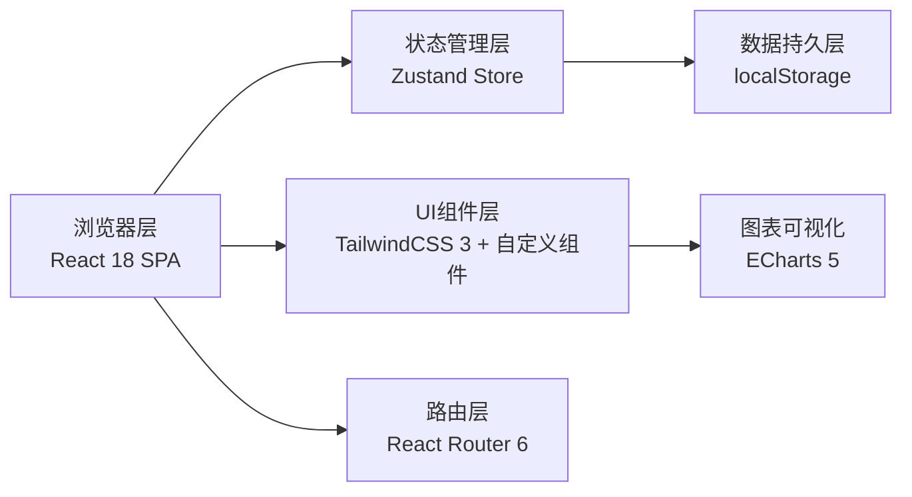
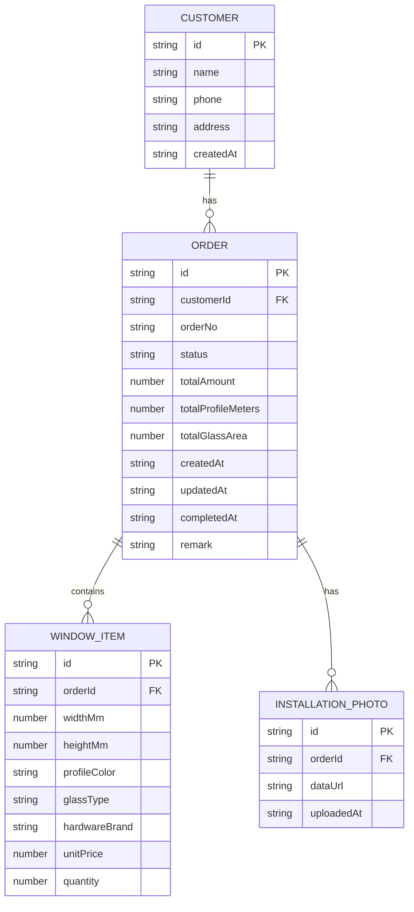

## 1. 架构设计

纯前端应用，数据持久化通过浏览器 localStorage 实现，无需后端服务。



## 2. 技术说明

- **前端框架**：React 18 + TypeScript 5 + Vite 5
- **初始化工具**：vite-init（react-ts 模板）
- **样式方案**：TailwindCSS 3 + CSS Variables 主题系统
- **状态管理**：Zustand 4（轻量级，天然支持持久化中间件）
- **路由管理**：React Router 6
- **图表库**：ECharts 5（轻量化，中文支持好）
- **图标库**：lucide-react
- **后端**：无（纯前端本地存储）
- **数据库**：localStorage（JSON格式存储，通过 Zustand persist 中间件自动同步）

## 3. 路由定义

| 路由路径 | 页面名称 | 用途 |
|----------|----------|------|
| `/` | 仪表盘 | 订单概览、统计卡片、快捷操作 |
| `/orders` | 订单列表 | 全部订单、搜索筛选、进度操作 |
| `/orders/new` | 新建订单 | 填写客户信息和门窗明细 |
| `/orders/:id` | 订单详情/编辑 | 查看订单详情、编辑信息、更新进度、上传照片 |
| `/customers` | 客户列表 | 全部客户、搜索、查看详情 |
| `/customers/:id` | 客户详情 | 客户信息、历史订单、消费统计 |
| `/statistics` | 统计报表 | 月度统计、颜色销量、玻璃分布、营收趋势 |

## 4. 数据模型

### 4.1 ER 图



### 4.2 核心枚举值

订单状态流转顺序：
```typescript
type OrderStatus = 
  | 'placed'      // 已下单
  | 'producing'   // 生产中
  | 'shipped'     // 已发货
  | 'installing'  // 待安装
  | 'completed'   // 已完工

const STATUS_LABELS: Record<OrderStatus, string> = {
  placed: '已下单',
  producing: '生产中',
  shipped: '已发货',
  installing: '待安装',
  completed: '已完工'
}

const STATUS_FLOW: OrderStatus[] = ['placed', 'producing', 'shipped', 'installing', 'completed']
```

玻璃类型：
```typescript
type GlassType = 'single' | 'double'  // 单层 / 双层
const GLASS_LABELS = { single: '单层玻璃', double: '双层中空玻璃' }
```

### 4.3 自动计算公式

```
单扇窗户型材米数 = (宽 + 高) × 2 ÷ 1000  (毫米转米)
单扇窗户玻璃面积 = 宽 × 高 ÷ 1,000,000   (平方毫米转平方米)
型材总米数 = Σ(单扇型材米数 × 数量)
玻璃总面积 = Σ(单扇玻璃面积 × 数量)
订单总金额 = Σ(单价 × 数量)
```

## 5. 项目目录结构

```
src/
├── components/           # 可复用组件
│   ├── layout/          # 布局组件（Sidebar、Header、PageContainer）
│   ├── order/           # 订单相关组件（OrderCard、OrderForm、StatusBadge、ProgressButton）
│   ├── customer/        # 客户相关组件
│   ├── statistics/      # 统计图表组件
│   └── common/          # 通用组件（Button、Input、Card、Modal）
├── pages/               # 页面组件
│   ├── Dashboard.tsx
│   ├── OrderList.tsx
│   ├── OrderNew.tsx
│   ├── OrderDetail.tsx
│   ├── CustomerList.tsx
│   ├── CustomerDetail.tsx
│   └── Statistics.tsx
├── store/               # Zustand Store
│   ├── index.ts         # 主 Store，包含 orders、customers 切片
│   ├── types.ts         # 类型定义
│   └── initialData.ts   # Mock 初始数据
├── hooks/               # 自定义 Hooks
│   ├── useOrderCalc.ts  # 订单计算逻辑
│   └── useStatistics.ts # 统计聚合逻辑
├── utils/               # 工具函数
│   ├── calculator.ts    # 型材/玻璃计算函数
│   ├── format.ts        # 金额、日期格式化
│   └── storage.ts       # localStorage 封装
├── App.tsx              # 路由配置
├── main.tsx             # 入口文件
└── index.css            # 全局样式 + Tailwind 主题
```

## 6. 初始Mock数据

预置6-8条典型订单数据，覆盖：
- 不同的订单状态（每个状态至少1条）
- 不同型材颜色（深咖、砂灰、白色、氟碳金等主流颜色）
- 不同玻璃类型（单层/双层）
- 不同五金品牌（好博HOPO、坚朗KINLONG、国强等）
- 不同下单月份（近3个月数据便于统计展示）
- 3-4个重复客户用于测试历史查询功能
